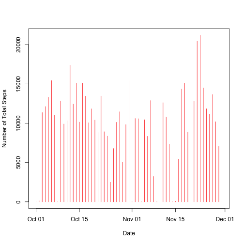
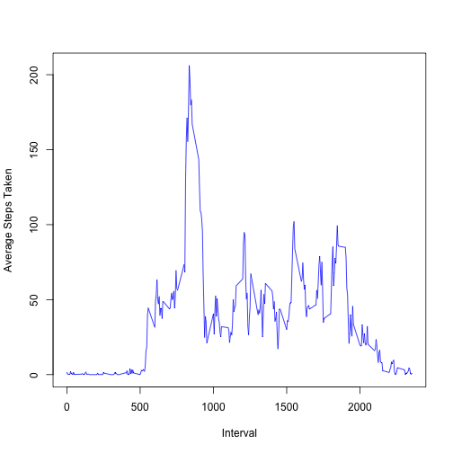
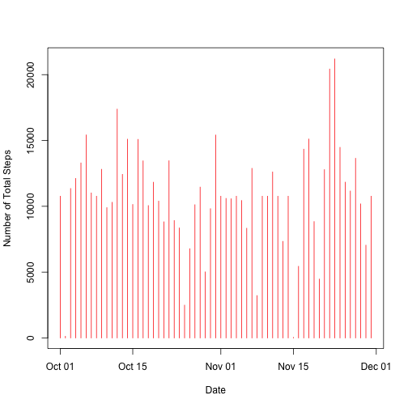
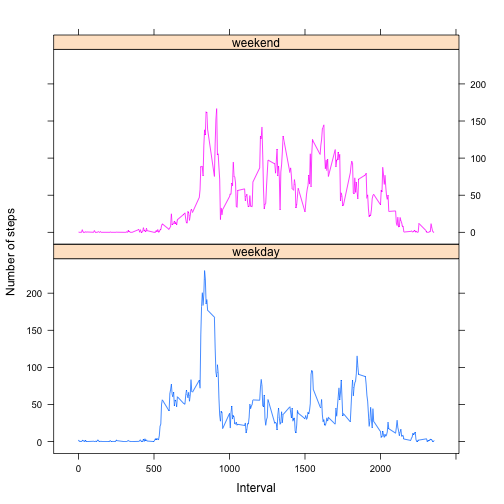

# Reproducible Research: Peer Assessment 1

```r
opts_chunk$set(echo = TRUE)
```


## Loading and preprocessing the data

```r
activityData <- read.csv("activity.csv", colClasses = c("integer", "Date", "integer"))
```


## What is mean total number of steps taken per day?

```r
library(reshape2)
meltActivityData <- melt(activityData, id.vars = "date", measure.vars = c("steps", 
    "interval"), na.rm = TRUE)
castActivityData <- dcast(meltActivityData, date ~ variable, sum)
plot(castActivityData$date, castActivityData$steps, type = "h", col = "red", 
    xlab = "Date", ylab = "Number of Total Steps")
```

 

```r
meanSteps <- mean(castActivityData$steps)
medianSteps <- median(castActivityData$steps)
```

The mean and median of total number of steps taken each day are 9354.2295 and 10395 respectively.


## What is the average daily activity pattern?

```r
meltActivityData1 <- melt(activityData, id.vars = c("interval"), measure.vars = c("steps", 
    "date"), na.rm = TRUE)
castActivityData1 <- dcast(meltActivityData1, interval ~ variable, mean)
plot(castActivityData1$interval, castActivityData1$steps, type = "l", col = "blue", 
    xlab = "Interval", ylab = "Average Steps Taken")
```

 


## Imputing missing values

```r

library(reshape2)
numRowWithNa = nrow(activityData[is.na(activityData), ])
activityData1 <- activityData
intervalVector <- unique(as.integer(activityData1$interval))
for (i in intervalVector) {
    activityData1[is.na(activityData1) & activityData1$interval == i, ]$steps <- mean(activityData1[activityData1$interval == 
        i, ]$steps, na.rm = TRUE)
}
meltActivityData2 <- melt(activityData1, id.vars = "date", measure.vars = c("steps", 
    "interval"), na.rm = FALSE)
castActivityData2 <- dcast(meltActivityData2, date ~ variable, sum)
plot(castActivityData2$date, castActivityData2$steps, type = "h", col = "red", 
    xlab = "Date", ylab = "Number of Total Steps")
```

 

```r
meanSteps2 <- mean(castActivityData2$steps)
medianSteps2 <- median(castActivityData2$steps)
```

The mean and median of total number of steps taken each day are 1.0766 &times; 10<sup>4</sup> and 1.0766 &times; 10<sup>4</sup> respectively.

## Are there differences in activity patterns between weekdays and weekends?

```r
library(lattice)
wdayVec = c("Mon", "Tue", "Wed", "Thu", "Fri")
wendVec = c("Sat", "Sun")
day = weekdays(activityData1$date, abbreviate = TRUE)
day[day %in% wdayVec] <- "weekday"
day[day %in% wendVec] <- "weekend"
day <- factor(day)
newActivityData <- cbind(activityData1, day)

meltActivityData3 <- melt(newActivityData, id.vars = c("interval", "day"), measure.vars = "steps", 
    na.rm = FALSE)
castActivityData3 <- dcast(meltActivityData3, interval + day ~ variable, mean)
xyplot(castActivityData3$steps ~ castActivityData3$interval | castActivityData3$day, 
    group = castActivityData3$day, type = "l", layout = c(1, 2), xlab = "Interval", 
    ylab = "Number of steps")
```

 

